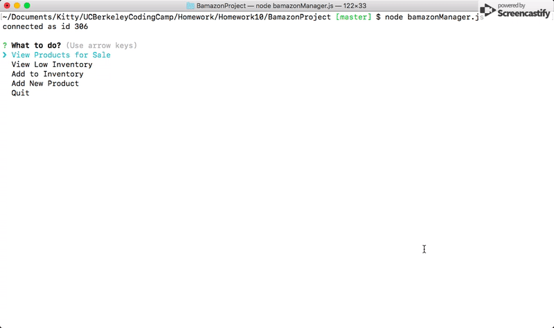
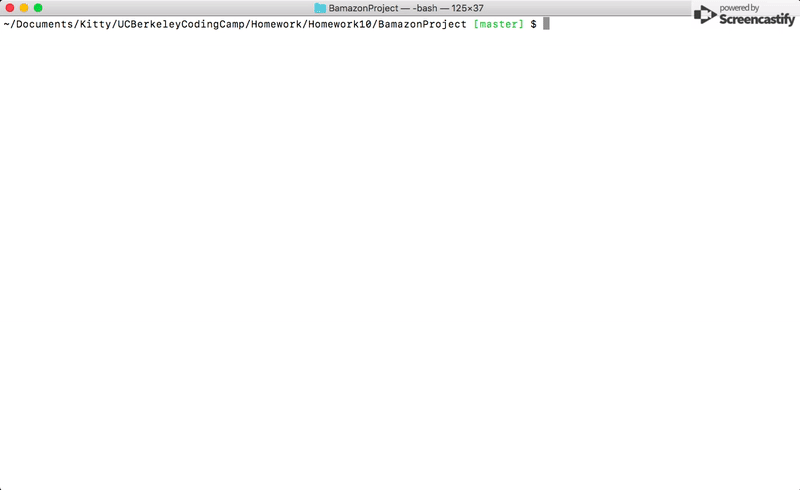

# BamazonProject
UC Berkeley coding assignment 10

## Overview

In this activity, you'll be creating an Amazon-like storefront with the MySQL skills learned this week. The app will take in orders from customers and deplete stock from the store's inventory. As a bonus task, you can program your app to track product sales across your store's departments and then provide a summary of the highest-grossing departments in the store.

Make sure you save and require the MySQL and Inquirer npm packages in your homework files--your app will need them for data input and storage.

## Instructions

### Challenge #1: Customer View (Minimum Requirement)


1. Create a MySQL Database called `bamazon`.

2. Then create a Table inside of that database called `products`.

3. The products table should have each of the following columns:

   * item_id (unique id for each product)
   * product_name (Name of product)
   * department_name
   * price (cost to customer)
   * stock_quantity (how much of the product is available in stores)

4. Populate this database with around 10 different products. (i.e. Insert "mock" data rows into this database and table).

5. Then create a Node application called `bamazonCustomer.js`. Running this application will first display all of the items available for sale. Include the ids, names, and prices of products for sale.

6. The app should then prompt users with two messages.

   * The first should ask them the ID of the product they would like to buy.
   * The second message should ask how many units of the product they would like to buy.

7. Once the customer has placed the order, your application should check if your store has enough of the product to meet the customer's request.

   * If not, the app should log a phrase like `Insufficient quantity!`, and then add max possible amount in stock to cart.

8. However, if your store _does_ have enough of the product, you should fulfill the customer's order.
   * This means updating the SQL database to reflect the remaining quantity.
   * Once the update goes through, show the customer the total cost of their purchase.

this activity took me about 3 hours


### Challenge #2: Manager View (Next Level)




* Create a new Node application called `bamazonManager.js`. Running this application will:

  * List a set of menu options:
    * View Products for Sale
    * View Low Inventory
    * Add to Inventory
    * Add New Product

  * If a manager selects `View Products for Sale`, the app should list every available item: the item IDs, names, prices, and quantities.

  * If a manager selects `View Low Inventory`, then it should list all items with an inventory count lower than five.

  * If a manager selects `Add to Inventory`, your app should display a prompt that will let the manager "add more" of any item currently in the store.

  * If a manager selects `Add New Product`, it should allow the manager to add a completely new product to the store.

- - -

* About another 2 hours.

- - -

### Challenge #3: Supervisor View (Final Level)



1. Create a new MySQL table called `departments`. Your table should include the following columns:

   * department_id

   * department_name

   * over_head_costs (A dummy number you set for each department)

2. Modify the products table so that there's a product_sales column and modify the `bamazonCustomer.js` app so that this value is updated with each individual products total revenue from each sale.

3. Modify your `bamazonCustomer.js` app so that when a customer purchases anything from the store, the price of the product multiplied by the quantity purchased is added to the product's product_sales column.

   * Make sure your app still updates the inventory listed in the `products` column.

4. Create another Node app called `bamazonSupervisor.js`. Running this application will list a set of menu options:

   * View Product Sales by Department

   * Create New Department

5. When a supervisor selects `View Product Sales by Department`, the app should display a summarized table in their terminal/bash window. Use the table below as a guide.

| department_id | department_name | over_head_costs | product_sales | total_profit |
| ------------- | --------------- | --------------- | ------------- | ------------ |
| 01            | Electronics     | 10000           | 20000         | 10000        |
| 02            | Clothing        | 60000           | 100000        | 40000        |

6. The `total_profit` column should be calculated on the fly using the difference between `over_head_costs` and `product_sales`. `total_profit` should not be stored in any database. You should use a custom alias.


## Technology used
* Node.js
* Node package used :
  * inquirer:   npm install inquirer
  * mysql:  npm install  mysql
  * cli table:  npm install cli-table
* javascript
* MySQL

## Key learning points
```javascript
// create DB quick reference
DROP DATABASE IF EXISTS bamazon;
CREATE DATABASE bamazon;
USE bamazon;

CREATE TABLE departments (
  department_id INT NOT NULL AUTO_INCREMENT  PRIMARY KEY,
  department_name VARCHAR(45) NOT NULL,
  over_head_costs FLOAT(10,2) NOT NULL
);

INSERT INTO departments (department_name,over_head_costs) VALUES ("Toy", 900) ,("Game", 800) ("Food",600),("Clothes" , 800);
```

```javascript
// connection quick reference
var connection = mysql.createConnection({
    host: "localhost",
    port: 3306,
    user: "root",
    password: "password",
    database: "bamazon"
});
```

```javascript
// Query call sample quick reference
connection.query("UPDATE products SET ? WHERE ?",
    [{stock_quantity:number,product_sales:sales},{product_name:name}],
    function(err,data){
        if (err) throw err;
        //data ...
});

```

```javascript
// Query call get json data back 
// my sql alias, join, sum and group by 
  connection.query("SELECT A.department_id,A.department_name, A.over_head_costs,SUM(B.product_sales) AS totalSale FROM departments as A INNER JOIN products as B ON (A.department_name = B.department_name) GROUP BY A.department_id", function (err, result) {
    ...
    tableRowInsert(table,result[i].department_id, result[i].department_name, result[i].over_head_costs, result[i].totalSale, result[i].totalSale- result[i].over_head_costs);
    ...
  });
```

```javascript
// additional stuff save the current order as a sub object in the itemPurchased obj  
if(itemPurchased[itemName] == null) itemPurchased[itemName]= price.toFixed(2);  //first time purchase this item , create sub obj using itemName as key
else itemPurchased[itemName] = (parseFloat(itemPurchased[itemName]) + parseFloat(price.toFixed(2))).toFixed(2);
// note to myself: data back from data base all in string format, if need to do math convert into number type first                    
```

```javascript
// Inquirer usage sample quick reference
inquirer.prompt([
    {
        type: "list",
        message: "Purchase any items on sale or Exit the store?",
        choices: ["Purchase", "Quit"],
        name: "action"
    }
]).then(function (response) {
  response.action  ...
}
```

```javascript
// cli table quick reference
var Table = require('cli-table');
table = new Table({
            head: ['Dept #','Department Name', 'OverHead Cost', 'Product Sales'], colWidths: [8, 40,20,20]
        });
//define table row insert function, need to insert 2d array
function tableRowInsert(table,a,b,c,d){
    arr = [];
    arr.push(a,b,c,d)
    table.push(arr);
}
```

```javascript
//notes to myself recursion function managing() return to main menu need to be called inside 
//connection query to make sure return to main menu after database action finished, 
//otherwise might throw error due to query itself is async 
```

### Author 
[Kitty Shen ](https://github.com/kittyshen)

### [Link to Portfolio Site](https://kittyshen.github.io/Portfolio/)


